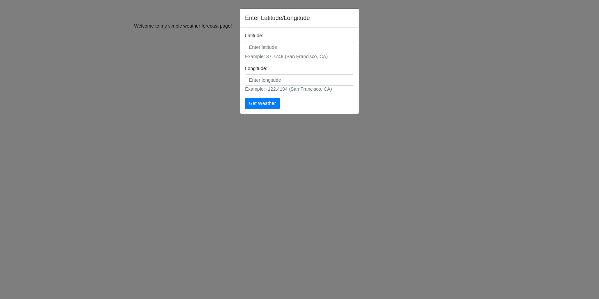
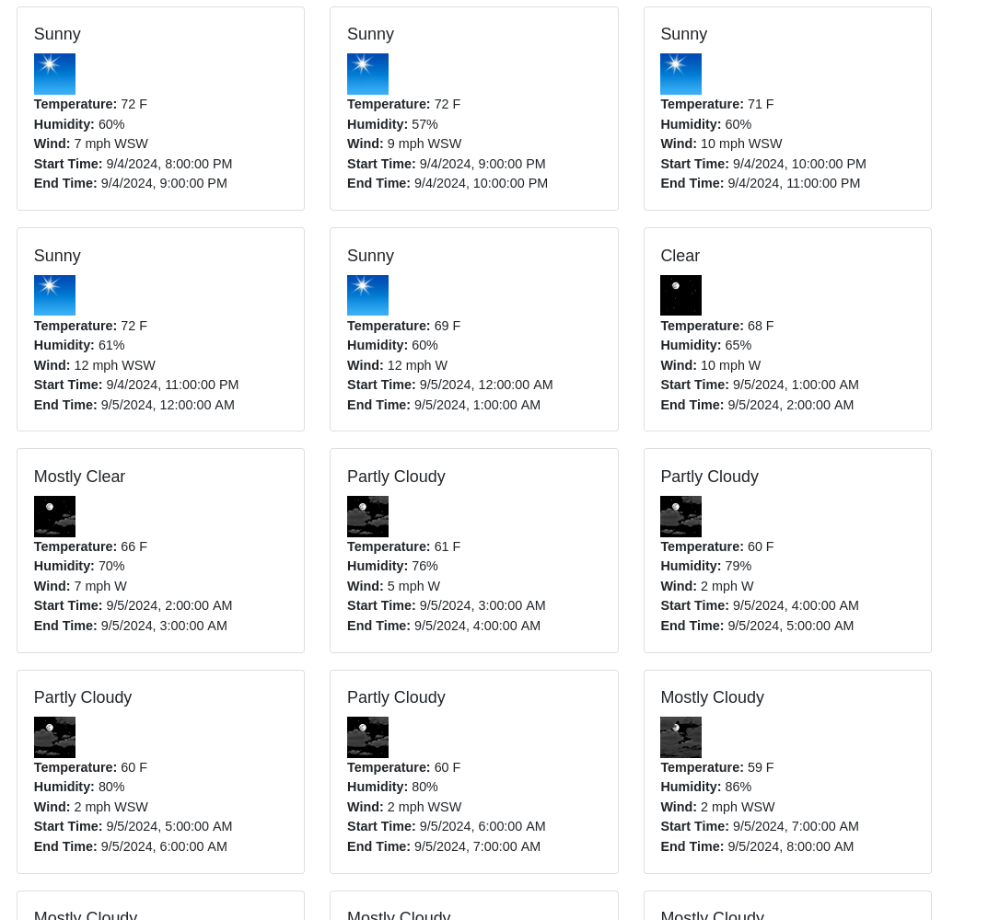
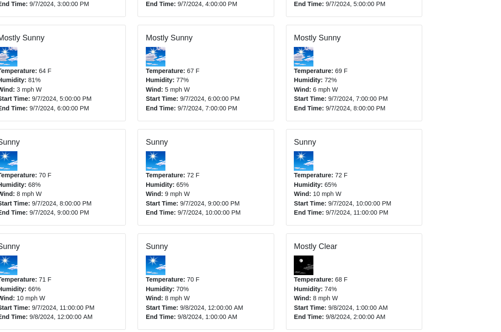

# HC simpleweatherapp

This is a simple weather application that uses API.weather.gov to get the weather data for a given location.

I wrote this app in typescript with Bun and Elysia.
The frontend is simple HTML/CSS/JS with Bootstrap.

## How to run

Please use `bun install` after cloning the repository.

## How to use

Run the application with `bun start`.

The API is `/weather?latitude=xx&longitude=yy` where `xx` and `yy` are the latitude and longitude of the location you want to get the weather for.

If you go to `/` or `/index.html` you will see a simple form to enter the latitude and longitude. From there, it will conveniently show you the data from the API in a nice format.

